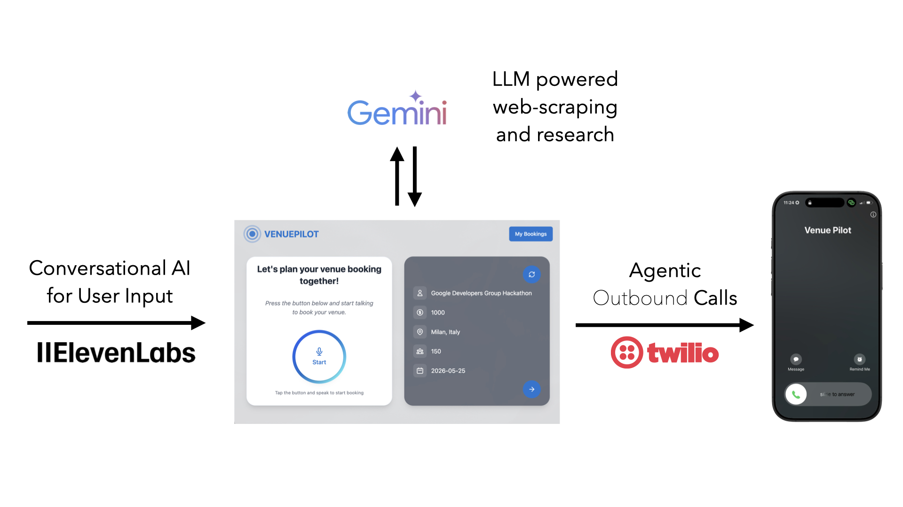

# Google Developers Group AI Hack 2025 - Team PYM VenuePilot



## Project info
AI Hack 2025 is a hackathon organized by Google Developers Group (GDG) in Milan Italy. VenuePilot is an agentic AI venue booking concierge. The project won second place in the hackathon.

Follow these steps to test the project locally:

```sh
# Step 1: Clone the repository using the project's Git URL.
git clone https://github.com/andrew-elsayeh/venue_pilot.git

# Step 2: Navigate to the project directory.
cd venue_pilot

# Step 3: Install the necessary dependencies.
npm i

# Step 4: Start the development server with auto-reloading and an instant preview.
npm run dev
```

## Technologies used for the project
This project is built with:

- Vite
- TypeScript
- React
- shadcn-ui
- Tailwind CSS


